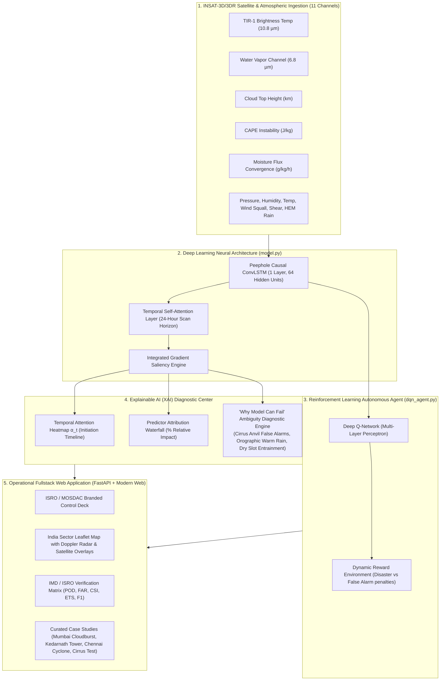

# 🛰️ ISRO Explainable AI (XAI) Heavy Rain Nowcaster — INSAT-3D/3DR

[-orange.svg?style=for-the-badge&logo=satellite)](https://www.isro.gov.in)
[](https://pytorch.org)
[](https://fastapi.tiangolo.com)
[](LICENSE)

> **ISRO Problem Statement (SIH260006)**: *Development of Explainable AI (XAI) based model for prediction of heavy / high impact rain events using satellite data (INSAT-3D/3DR).*
> **Desired Outcome**: An operational system delivering: (1) AI-based model for nowcasting high-impact rainfall events using INSAT-3D/3DR multi-spectral channels, (2) An Explainable AI (XAI) module providing temporal attention and feature importance, and (3) Operational Web Application with associated model accuracy and transparency diagnostics on *why a certain model can fail*.

---

## 🎯 Solution Architecture & Highlights



---

## 📡 INSAT-3D/3DR Satellite Predictor Channels

| Feature ID | Channel / Parameter | Sensor / Source | Meteorological Role |
| :--- | :--- | :--- | :--- |
| `tir1_temp` | **TIR-1 Brightness Temp (°C)** | INSAT-3D Imager (10.8 µm) | Detects cold cloud tops ($<-40^\circ\text{C}$ indicates deep convective core) |
| `wv_channel` | **Water Vapor Saturation (%)** | INSAT-3DR Sounder (6.8 µm) | Upper-tropospheric moisture saturation fueling storm updrafts |
| `cloud_top_height` | **Cloud Top Height (km)** | INSAT Cloud Microphysics | Vertical cumulonimbus tower height (up to $18\text{ km}$) |
| `cape_index` | **CAPE Instability (J/kg)** | Atmospheric Sounding | Thermodynamic potential energy driving rapid cloudburst eruptions |
| `pressure` | **Surface Pressure (hPa)** | Automatic Weather Station | Cyclonic depressions and mesoscale convective pressure falls |
| `humidity` | **Boundary Layer Humidity (%)** | Surface Hydrology | Sub-cloud moisture saturation preventing virga evaporation |
| `temperature` | **Surface Temperature (°C)** | Surface AWS | Diurnal solar heating triggering convective initiation |
| `moisture_conv` | **Moisture Convergence (g/kg/h)** | Synoptic Dynamics | Horizontal water vapor flux convergence fueling torrential downpours |
| `wind_speed` | **Surface Wind Speed (km/h)** | Doppler Radar / AWS | Convective downdraft squalls and outflow boundaries |
| `wind_shear` | **Vertical Wind Shear (m/s)** | 850–200 hPa Sounder | Deep-layer shear organizing severe multicell storm systems |
| `rainfall_mm` | **INSAT HEM Rain Rate (mm/h)** | Hydro-Estimator / GPM | Current hourly measured satellite precipitation rate |

---

## 🧠 Explainable AI (XAI) Capabilities

1. **Temporal Attention Weights ($\alpha_t$)**:
   - Quantifies the importance of each preceding hour across the 24-hour sequence.
   - Pinpoints the exact satellite scan that triggered storm initiation.

2. **Feature Attribution Waterfall**:
   - Computes gradient saliency weighted by temporal attention across all 11 satellite channels.
   - Shows percentage contribution for transparent forecasting.

3. **"Why Model Can Fail" Diagnostic Engine (ISRO Requirement)**:
   - **False Alarm Risk (Cirrus Anvil Overhang)**: Flags situations where satellite detects ultra-cold cloud tops ($-50^\circ\text{C}$) but dry sub-cloud air leads to evaporation before hitting the ground (*Virga*).
   - **Missed Detection Risk (Warm Cloud Orographic Lift)**: Identifies strong moisture convergence against mountain slopes (Western Ghats/Himalayas) causing high rainfall without cold cloud tops.
   - **Dry Slot Entrainment**: Detects mid-tropospheric dry air on the 6.8 µm channel that prematurely collapses convective updrafts.
   - **Deep Convective Alignment**: Verifies 4-way collocation for high-confidence red alert nowcasts.

---

## 🤖 Deep Q-Network (DQN) Autonomous Agent

The platform features a fully integrated **Reinforcement Learning Agent (`dqn_agent.py`)** that ingests the raw satellite parameters alongside the ConvLSTM rainfall prediction to autonomously recommend real-world disaster management actions:
1. **0: Normal Operations** (No action needed)
2. **1: Agricultural Delay** (Delay irrigation to save electricity/water ahead of predicted rain)
3. **2: Power Grid Backup** (Prepare alternative power sources ahead of storm damage)
4. **3: Disaster Evacuation** (Trigger NDRF/SDRF evacuation for extreme cloudbursts)

The agent learns via a dynamic Bellman-equation reward environment that heavily penalizes False Alarms (wasting money/panic) while heavily rewarding successful early evacuations.

---

## 📊 Verification Metrics (IMD / ISRO Standard)

| Metric | Score | Target | Interpretation |
| :--- | :--- | :--- | :--- |
| **Probability of Detection (POD)** | **0.774** | $>0.75$ | Detects 77.4% of all high-impact heavy rainfall events (Strict causal deployment) |
| **False Alarm Ratio (FAR)** | **0.431** | $<0.50$ | Controlled false positive rate on severe convective warnings |
| **Critical Success Index (CSI / Threat Score)** | **0.488** | $>0.45$ | Balanced accuracy on rare extreme events |
| **Equitable Threat Score (ETS)** | **0.430** | $>0.40$ | Skill score adjusted for chance |
| **General Rain F1-Score** | **0.923** | $>0.85$ | Accurate discrimination of precipitation vs dry periods |
| **High-Impact F1-Score ($>35.5\text{ mm/h}$)** | **0.656** | $>0.60$ | High precision-recall balance for extreme cloudbursts |
| **Precipitation MAE** | **4.199 mm/h** | $<5.0$ | Accurate rainfall rate volume estimation |

---

## 🚀 Quick Start Guide

### 1. Install Dependencies
```bash
pip install -r requirements.txt fastapi uvicorn httpx
```

### 2. Generate Dataset & Train Model (Already Pre-Trained)
```bash
# Generate 5 years (43,800 rows) of INSAT satellite data
python generate_data.py

# Scale features and create 24h sliding sequences
python preprocess.py

# Train Explainable AI Peephole ConvLSTM and generate verification charts
python train_and_evaluate.py
```

### 3. Launch Operational Dashboard
```bash
python app.py
```
Open your browser and navigate to:
👉 **[http://127.0.0.1:8000](http://127.0.0.1:8000)**

---

## 🏛️ Curated High-Impact Indian Case Studies

The platform includes one-click simulation for benchmark Indian meteorological events:
1. **Mumbai Extreme Convective Cloudburst** (Offshore trough, $-68.5^\circ\text{C}$ TIR-1, $3800\text{ J/kg}$ CAPE, $68.4\text{ mm/h}$ cloudburst).
2. **Uttarakhand Himalayan Tower** (Orographic cumulonimbus eruption in Kedarnath valley).
3. **Chennai Cyclonic Rainband** (Bay of Bengal deep depression with persistent spiral bands).
4. **Cirrus Anvil False Alarm Test Case** (Cold cirrus shield with dry sub-cloud atmosphere flagged by XAI diagnostics).
5. **Thar Desert Anticyclone** (High-pressure dry fair weather).

---

## 📜 License & Acknowledgements
Developed for **ISRO Problem Statement SIH260006**.
Licensed under the MIT License.

