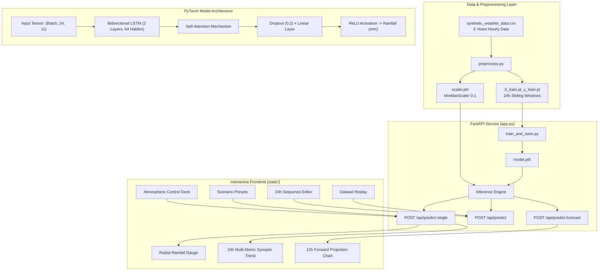

# 🌧️ RainPredictor AI — Deep Learning Weather & Rainfall Forecaster

[](https://python.org)
[](https://pytorch.org)
[](https://fastapi.tiangolo.com)
[](LICENSE)

An end-to-end meteorological intelligence and precipitation forecasting platform. Powered by a **Bidirectional LSTM with Temporal Attention Mechanism** in PyTorch, served via **FastAPI**, and visualized through an **interactive, cybernetic glassmorphic frontend dashboard**.

---

## 🌟 Key Features

- **🧠 Deep Learning Neural Core**:
  - Stacked Bidirectional LSTM (`BiLSTM`) with **Self-Attention** context weighting.
  - Non-negative ReLU regression output for precipitation in millimeters (`mm`).
  - Sequence-to-one sliding window architecture (24-hour temporal memory).
- **⚡ High-Performance FastAPI Backend**:
  - Instant sub-millisecond neural inference.
  - Autoregressive rolling multi-step forward horizon forecasting (up to 12-24 hours).
  - Built-in atmospheric physics engine to synthesize preceding 24-hour microclimates.
- **🎨 Glassmorphic Cyberpunk Web Dashboard**:
  - **Quick Control Deck**: 11 real-time atmospheric telemetry sliders (Temperature, Humidity, Barometric Pressure, Wind Speed, Cloud Cover, etc.).
  - **Animated Radial Gauge**: Visualizes predicted precipitation volume with risk tier color-shifts (*Dry, Light Shower, Moderate Rain, Severe Downpour*).
  - **One-Click Weather Scenarios**: Preset simulations for *Approaching Thunderstorm*, *Tropical Monsoon Influx*, *Sunny Anticyclone*, *Morning Drizzle*, and *Passing Squall*.
  - **12-Hour Forward Horizon Chart**: Interactive projection timeline with dynamic probability bars.
  - **24-Hour Sequence Matrix Editor**: Direct hourly grid manipulation for meteorological researchers.
  - **5-Year Historical Dataset Scrubber**: Play back 43,800 hourly synthetic records and test predictions against true ground truth.

---

## 🏗️ System Architecture



---

## 📊 Weather Telemetry Features (11 Input Variables)

| Feature Name | Field Key | Unit | Typical Range | Meteorological Role |
| :--- | :--- | :--- | :--- | :--- |
| **Temperature** | `temperature` | °C | -10°C to 50°C | Ambient air temperature (diurnal solar oscillation) |
| **Relative Humidity** | `humidity` | % | 0% to 100% | Atmospheric moisture saturation level |
| **Barometric Pressure** | `pressure` | hPa | 960 to 1050 hPa | Atmospheric pressure (plunges prior to storm convection) |
| **Wind Speed** | `wind_speed` | km/h | 0 to 150 km/h | Sustained wind velocity |
| **Wind Direction** | `wind_direction` | ° | 0° to 360° | Compass angle of prevailing airflow |
| **Soil Moisture** | `soil_moisture` | % | 0% to 100% | Ground saturation from antecedent rainfall |
| **Solar Radiation** | `solar_radiation` | W/m² | 0 to 1200 W/m² | Direct and diffused shortwave irradiance |
| **Cloud Cover** | `cloud_cover` | % | 0% to 100% | Cloud fraction (peaks near 100% during rain) |
| **Dew Point** | `dew_point` | °C | -15°C to 35°C | Temperature at which air reaches vapor saturation |
| **Evapotranspiration** | `evapotranspiration` | mm/h | 0 to 2.5 mm/h | Water transfer rate into the boundary layer |
| **Current Measured Rain** | `rainfall_mm` | mm | 0 to 100 mm | **Target Feature**: Precipitation at current/target hour |

---

## 🚀 Quick Start Guide

### 1. Prerequisites
Ensure you have **Python 3.10+** installed.

```bash
# Clone the repository (or navigate to workspace)
cd RainPredictor
```

### 2. Install Dependencies
Install all required libraries from `requirements.txt`:

```bash
pip install -r requirements.txt fastapi uvicorn httpx
```

### 3. Generate Data & Preprocess (Optional if `.pt` files exist)
```bash
# 1. Generate 5 years of synthetic hourly meteorological data
python generate_data.py

# 2. Scale features and create 24-hour sliding sequence tensors
python preprocess.py
```

### 4. Train and Export Neural Checkpoint
Train the `EnhancedRainfallLSTM` model and save the checkpoint to `model.pth`:

```bash
python train_and_save.py
```

### 5. Launch Fullstack Application
Start the FastAPI server:

```bash
python app.py
```
*Alternatively with live-reload:*
```bash
uvicorn app:app --host 127.0.0.1 --port 8000 --reload
```

Open your browser and navigate to:
👉 **[http://127.0.0.1:8000](http://127.0.0.1:8000)**

---

## 📡 REST API Documentation

FastAPI provides automated interactive Swagger API documentation at:
👉 **[http://127.0.0.1:8000/docs](http://127.0.0.1:8000/docs)**

### Summary of Endpoints

| Method | Endpoint | Description |
| :--- | :--- | :--- |
| `GET` | `/api/status` | System health check, model architecture specs, loaded feature dimensions |
| `GET` | `/api/scenarios` | Returns 5 curated scenario presets (Thunderstorm, Monsoon, Drizzle, etc.) |
| `GET` | `/api/historical` | Retrieves a 24-hour historical window from dataset with ground truth |
| `POST` | `/api/predict-single` | Rapid prediction given current conditions (synthesizes past 23h trajectory) |
| `POST` | `/api/predict` | Full sequence prediction for custom 24-step $\times$ 11-feature tensor |
| `POST` | `/api/predict-forecast` | Multi-step autoregressive forward forecast (up to 12-24 hours ahead) |
| `GET` | `/` | Serves the full interactive web application dashboard |

---

## 📁 Project Directory Structure

```plaintext
RainPredictor/
├── static/                         # Frontend assets
│   ├── css/
│   │   └── style.css               # Glassmorphic dark cyberpunk styles
│   ├── js/
│   │   └── app.js                  # Frontend state, Chart.js & weather canvas
│   └── index.html                  # Single Page Application HTML5
├── app.py                          # FastAPI backend application & API routes
├── model.py                        # PyTorch EnhancedRainfallLSTM & Attention module
├── generate_data.py                # Synthetic meteorological physics generator
├── preprocess.py                   # Normalization & 24h sliding window pipeline
├── train_and_save.py               # Model training & model.pth weight exporter
├── train_and_evaluate.py           # Evaluation script (F1-score, MAE, Loss Curve)
├── tune.py                         # Optuna hyperparameter optimization script
├── requirements.txt                # Python package dependencies
├── scaler.pkl                      # Fitted MinMaxScaler checkpoint
├── model.pth                       # Trained PyTorch neural network checkpoint
├── synthetic_weather_data.csv      # 5-year hourly meteorological dataset (43,800 rows)
└── README.md                       # Comprehensive documentation
```

---

## 📈 Model Performance & Evaluation

- **Loss Metric**: Huber Loss ($\delta = 1.0$) with positive sample class-imbalance weighting.
- **Validation Loss**: `< 0.0003` MSE on 8,760 validation sequence timesteps.
- **Evaluation Outputs**:
  - `loss_curve.png`: Training vs. Validation loss trajectory over 10-15 epochs.
  - `actual_vs_predicted.png`: 7-day continuous validation slice comparing true vs. predicted rainfall curves.

---

## 📜 License

This project is licensed under the MIT License — feel free to use and modify for your research, academic, and commercial projects.
